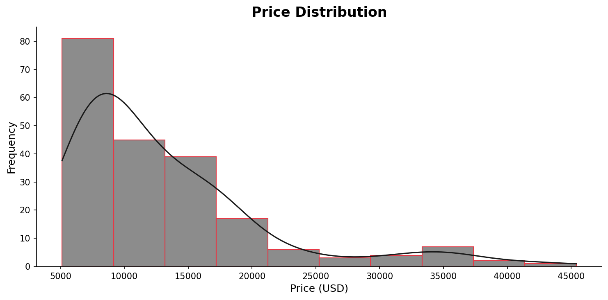
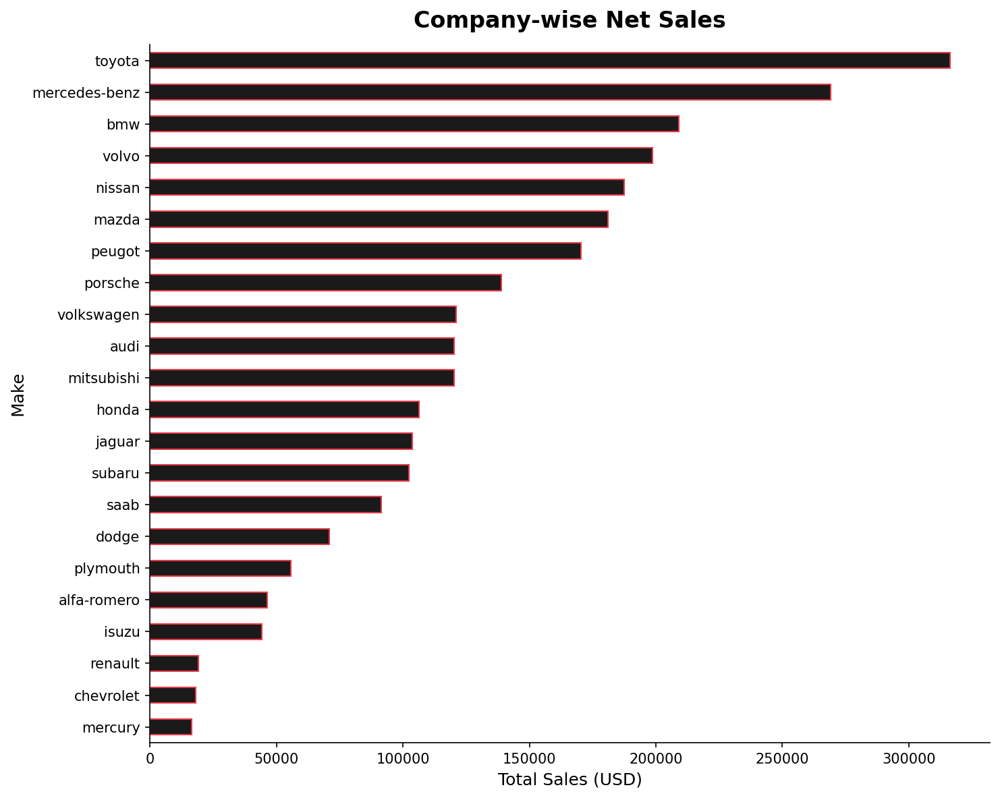
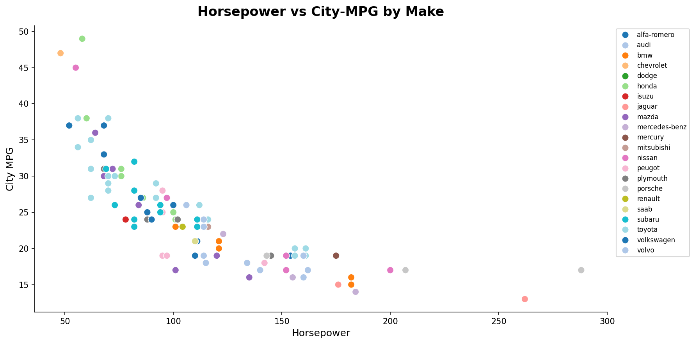
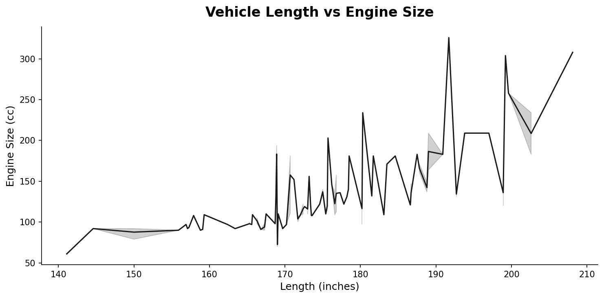
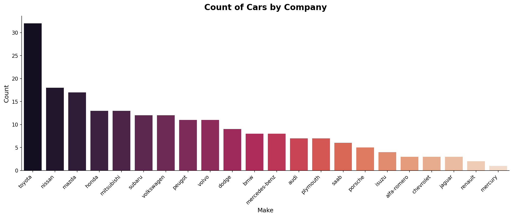
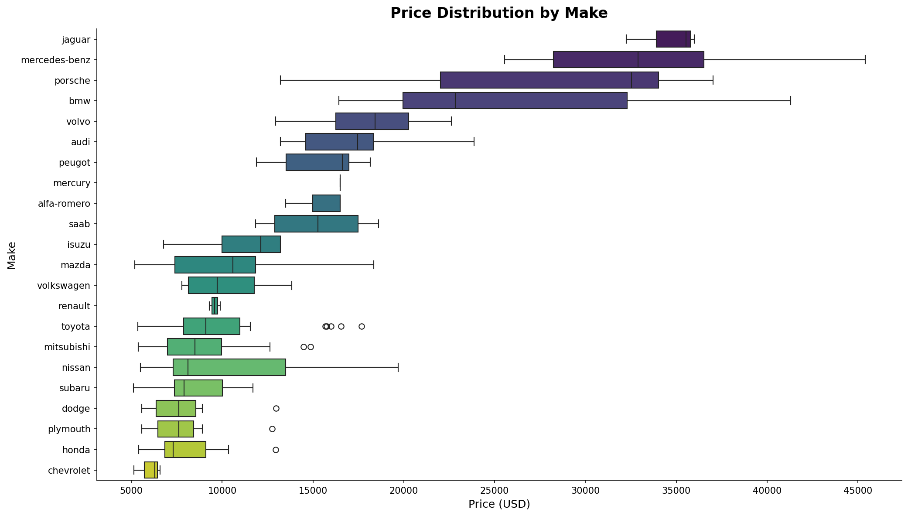
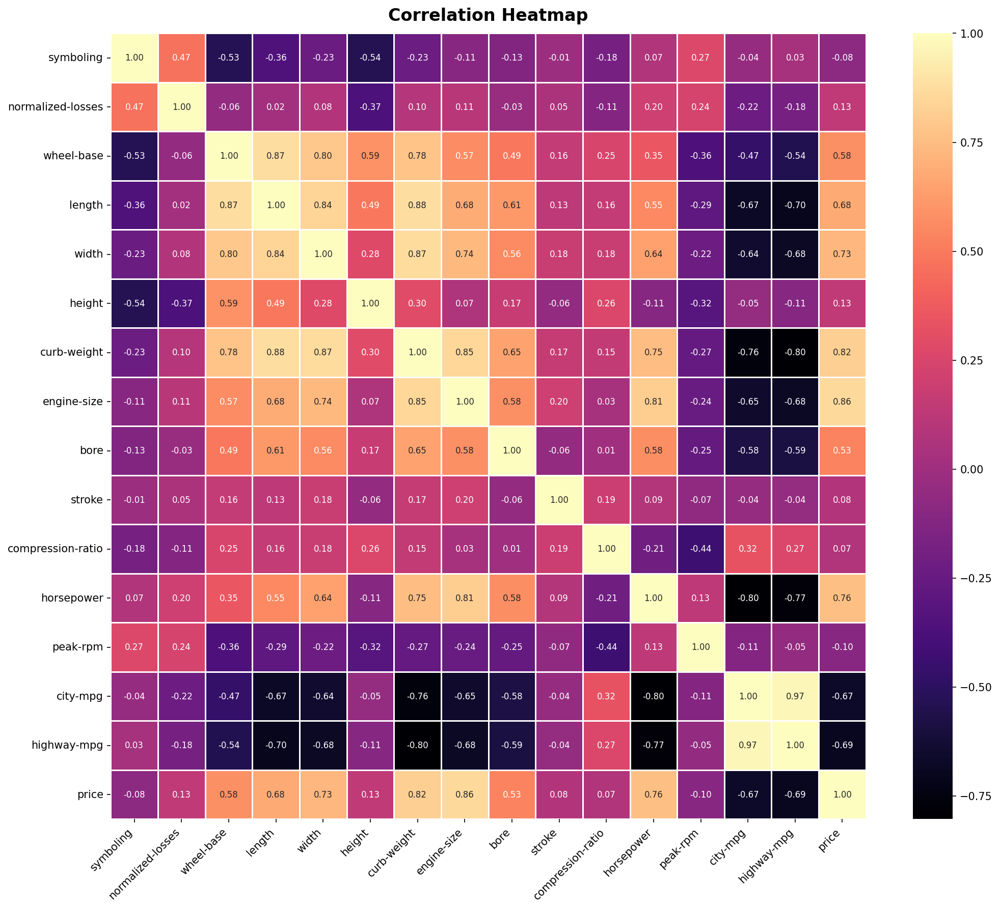
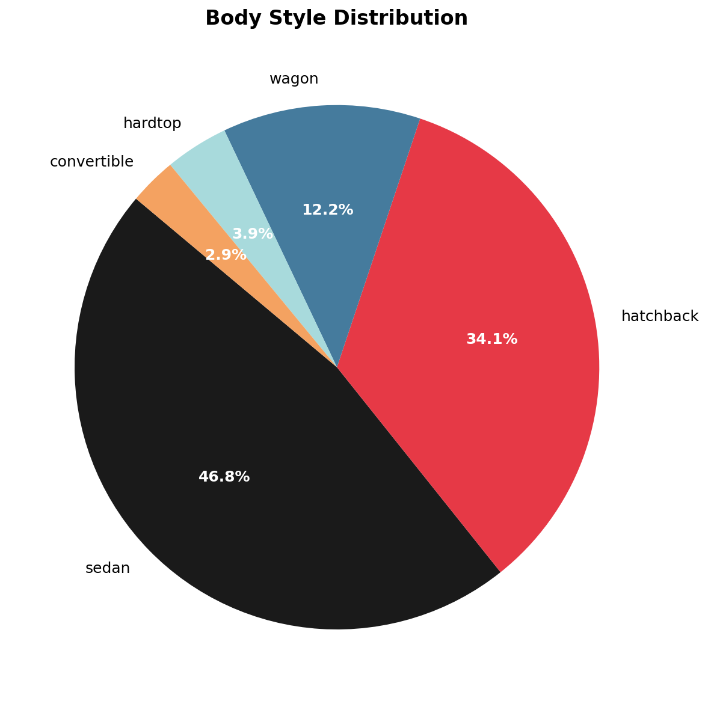
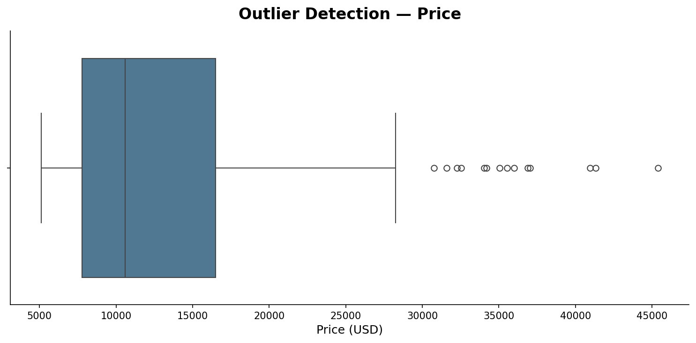

# 🚗 Automobile Data Analysis — Exploratory Data Analysis (EDA)

> **End-to-end EDA on a real-world automobile dataset** — from raw, dirty data to actionable insights using Python.

---

## 📌 Project Overview

This project performs a complete **Exploratory Data Analysis** on the UCI Automobile Dataset, covering **205 cars** across **22 manufacturers** with **26 features** — including price, horsepower, fuel type, engine size, and more.

The goal: clean messy real-world data and uncover meaningful patterns in the automotive market through statistical analysis and visualisation.

---

## 📊 Dataset at a Glance

| Attribute | Value |
|---|---|
| Records | 205 cars |
| Features | 26 columns |
| Manufacturers | 22 (Toyota → Mercedes-Benz) |
| Price Range | $5,118 — $45,400 |
| Average Price | ~$13,207 |
| Source | UCI Machine Learning Repository |

---

## 🔄 Project Workflow

```
Raw CSV  →  Data Cleaning  →  Type Conversion  →  EDA  →  Visualisation  →  Insights
```

---

## 🧹 Data Cleaning

The dataset ships with real-world messiness:

- **`?` placeholders** in numeric columns (`price`, `horsepower`, `bore`, `stroke`, `normalized-losses`, `peak-rpm`) — replaced with `NaN`, then imputed with column mean
- **Missing categorical values** — filled with column mode
- **Dtype mismatches** — all numeric columns force-converted using `pd.to_numeric(errors='coerce')`
- **Duplicates check** — confirmed zero duplicate rows

---

## 📈 Exploratory Data Analysis

### Key Findings

- 🏆 **Most expensive car:** Mercedes-Benz at **$45,400**
- 💰 **Cheapest car:** **$5,118**
- 📦 **Most models listed:** Toyota (32 entries)
- ⛽ **Fuel split:** 185 gas / 20 diesel
- 🚙 **Dominant body style:** Sedan (47%) followed by Hatchback (34%)
- 📊 **Top brand by total sales value:** Toyota, followed by Mercedes-Benz and BMW

---

## 📉 Visualisations

### 1. Price Distribution
> Univariate analysis with KDE — reveals a right-skewed distribution; most cars priced under $15,000 with a long premium tail.



---

### 2. Company-wise Net Sales
> Toyota leads total sales value, followed by Mercedes-Benz, BMW, and Volvo.



---

### 3. Horsepower vs City-MPG
> Clear negative correlation — higher horsepower cars return lower city mileage. Sports and luxury brands cluster at the high-HP, low-MPG end.



---

### 4. Vehicle Length vs Engine Size
> Longer vehicles tend to carry larger engines — particularly in the 170–190 inch range.



---

### 5. Count of Cars by Company
> Toyota dominates inventory count; Chevrolet, Honda, and Mitsubishi follow.



---

### 6. Price Distribution by Make (Box Plot)
> Porsche, Jaguar, and Mercedes-Benz show the highest median prices and widest spreads. Toyota and Honda anchor the affordable segment.



---

### 7. Correlation Heatmap
> Strong positive correlations: `engine-size ↔ price`, `curb-weight ↔ price`, `horsepower ↔ price`.
> Strong negative correlations: `city-mpg ↔ engine-size`, `highway-mpg ↔ horsepower`.



---

### 8. Body Style Distribution
> Sedans account for nearly half the dataset; hatchbacks follow. Convertibles are rare (3%).



---

### 9. Outlier Detection — Price
> Several high-value outliers identified above the $35,000 mark — predominantly Porsche, Jaguar, and Mercedes-Benz models.



---

## 🔑 Key Takeaways

| Insight | Finding |
|---|---|
| Price driver | Engine size and curb weight are the strongest price predictors |
| Efficiency trade-off | High horsepower strongly reduces fuel efficiency |
| Market leader | Toyota dominates both by volume and total sales value |
| Premium segment | Porsche & Mercedes-Benz command the highest and most variable prices |
| Body preference | Sedans and hatchbacks make up 81% of the market |

---

## 👤 Author

**Hari Charan K**
[](https://github.com/hrcharan001)

---

*Dataset source: [UCI Machine Learning Repository — Automobile Dataset](https://archive.ics.uci.edu/ml/datasets/automobile)*
